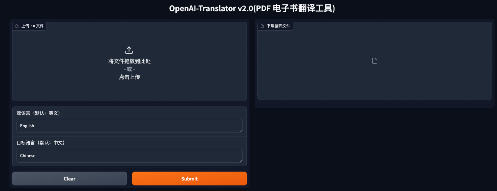
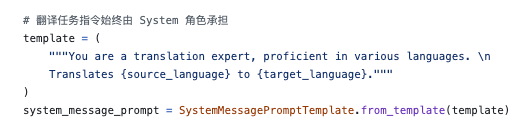

## homework
实战OpenAI-Translator
OpenAI-Translator V2.0 中的一个或多个特性
Feature List
1. 支持图形用户界面（GUI），提升易用性。(gradio)
2. 添加对保留源 PDF 的原始布局的支持。
3. 服务化：以 API 形式提供翻译服务支持。(flask)
4. 添加对其他语言的支持。

## answer
https://github.com/malinghan/openai-quickstart/tree/master/openai-translator-v2

```shell
cd ~/openai-quickstart/openai-translator-v2
export OPENAI_API_KEY='openai apikey'
python ai_translator/main.py
```
- 图形化界面
```shell
 python ai_translator/gradio_server.py 
 ```


- 风格化翻译：调试prompt
