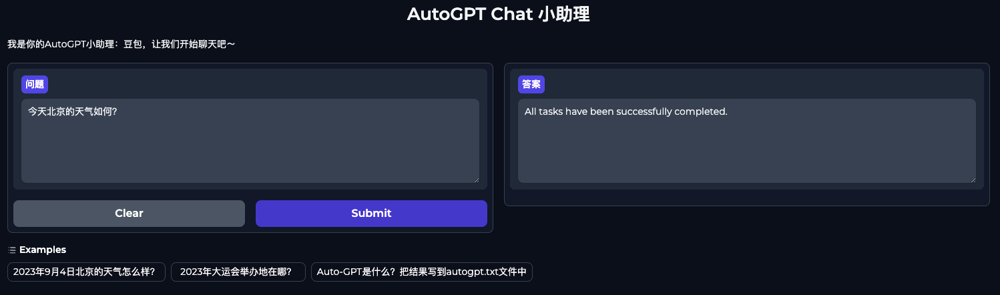

## homework
实现 LangChain 版本的 AutoGPT 项目的图形化界面。

## answer

```shell
cd ~/openai-quickstart/homework
export OPENAI_API_KEY='openai apikey'
export SERPAPI_API_KEY='google search apikey'
python langchain_autogpt.py
```

