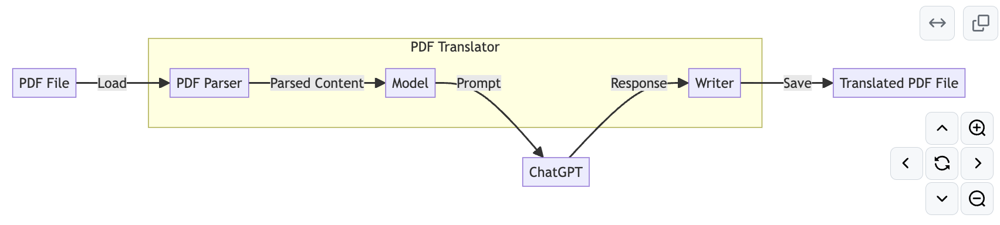

最近在极客时间学习《AI 大模型应用开发实战营》， 之前都是写java程序，没怎么接触python编程，在这里简单记录下开发过程和心得体会，供有兴趣的同学参考

# 功能概览
- 通过openai的chat API，实现一个pdf翻译器(1.0版本)
- 实现一个web GUI，可以上传pdf文件，然后翻译成目标语言的pdf文件(2.0版本)

# openai-translator2.0 作业
实现 OpenAI-Translator V2.0 中的一个或多个特性

Feature List
- 支持图形用户界面（GUI），提升易用性。
- 添加对保留源 PDF 的原始布局的支持。
- 服务化：以 API 形式提供翻译服务支持。
- 添加对其他语言的支持。

> 注意：在第六周中，实战OpenAI-Translator V2.0中已经基于langchain对1.0功能重新实现了一遍，同时将图形化界面、多语言的技术实现讲解清楚了

# 原始代码结构分析(opanai-translator 1.0版本)
```txt
openai-translator
    - ai_translator
        - book # 对要解析的文本定义和调用的封装 book -> page -> content
            - book.py
            - content.py
            - page.py
        - model # 对大模型定义和调用的封装
            - __init__.py  # 初始化模型
            - glm_model.py # glm模型定义和调用
            - model.py # 通用模型定义和调用
            - openai_model.py # openai模型定义和调用
        - translator
            - PDFTranslator.py ## PDFtranslator核心
            - PDFParser.py  ## PDF解析核心逻辑处理
            - exceptions.py ## PDF解析异常处理
            - Writer.py  ## PDF解析之后的输出处理
            - __init__.py 
        - utils ## 参数加载工具类
            - argument_parser.py # 对命令行参数的解析
            - config_loader.py  ## 用于加载config.yml参数到config中
        - main.py ## 主函数
    - fonts
        - simsum.ttc ## 解析中文所需字体
    - images  ## 演示样本
    - jupyter ## 测试pdfplumber这个工具的使用
        - images
        - The_Old_Man_of_The_Sea.pdf
        - pdf_image_test.png
        - pdfplumber.ipynb
        - test.pdf
    - tests # 输出目录
        - The_Old_Man_of_The_Sea.pdf
        - test.pdf
        - test_translated.pdf
    - config.yaml
    - requirements.txt
```

#  系统概述


> 参考：https://github.com/richzw/openai-quickstart/blob/feat/translator/openai-translator/ai_translator/summary.md

> https://www.gradio.app/guides/quickstart

# 图形界面实现
## 如何使用gradio
> 参考：https://github.com/gradio-app/gradio

- step1: 安装gradio
```bash
pip install gradio
```
- step2: 编写代码

```python
  import gradio as gr
 def greet(name, intensity):
    return "Hello, " + name + "!" * int(intensity)
  demo = gr.Interface(
    fn=greet,
    inputs=["text", "slider"],
    outputs=["text"],
  )
demo.launch()
  ```

- step3: 运行
  ```bash
  python gradio_demo.py
  ```

- step4: 访问web页面，访问 http://127.0.0.1:7860/

## 实现图形界面
> 参考: https://github.com/richzw/openai-quickstart/tree/main/langchain/openai-translator

- 调整配置文件 
```yaml
model_name: "gpt-3.5-turbo"
input_file: "tests/test.pdf"
output_file_format: "markdown"
source_language: "English"
target_language: "Chinese"
```

- 然后命令行直接运行：
```shell    
python ai_translator/main.py
```

```shell
# Set your api_key as an env variable
export OPENAI_API_KEY="sk-xxx"
python ai_translator/main.py --model_name "gpt-3.5-turbo" --input_file "your_input.pdf" --output_file_format "markdown" --source_language "English" --target_language "Chinese"
```
# 添加对保留源 PDF 的原始布局的支持

# 服务化：以 API 形式提供翻译服务支持
- flask 实现
```shell
curl -X POST -H "Content-Type: application/json" -d '{"text": "Hello world", "source_language": "en", "target_language": "zh"}' http://127.0.0.1:5000/translate
```
# 支持多语言翻译

